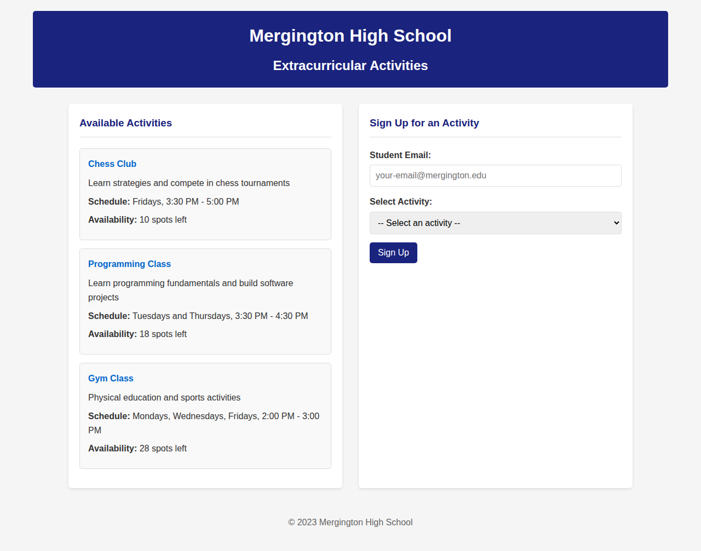
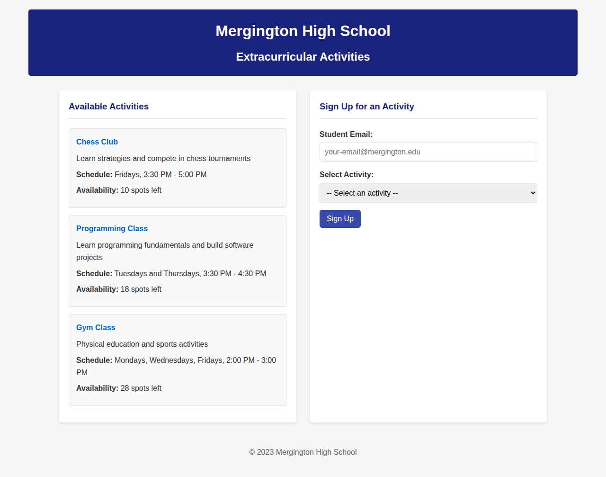

# Complete Explanation of app.py Program

## Quick Summary

**What it is**: A FastAPI web application for managing high school extracurricular activities  
**What it does**: Allows students to view available activities and sign up via a web interface  
**Technology**: Python FastAPI backend + HTML/CSS/JavaScript frontend  
**Data Storage**: In-memory (resets on restart)  
**Key Features**: Activity listing, student signup, responsive web UI  

## Overview

The `app.py` program is a **FastAPI web application** that serves as a **High School Management System API** for Mergington High School. It provides a simple yet functional platform for students to view and sign up for extracurricular activities.

## Application Architecture

### Technology Stack
- **Backend Framework**: FastAPI (Python web framework)
- **Frontend**: Static HTML, CSS, and JavaScript
- **Data Storage**: In-memory Python dictionaries (no database)
- **Server**: Uvicorn ASGI server

### Project Structure
```
src/
├── app.py              # Main FastAPI application
├── static/             # Frontend files
│   ├── index.html      # Main web page
│   ├── app.js          # Frontend JavaScript logic
│   └── styles.css      # Styling
└── README.md          # Technical documentation
```

## Core Components Explained

### 1. Imports and Setup
```python
from fastapi import FastAPI, HTTPException
from fastapi.staticfiles import StaticFiles
from fastapi.responses import RedirectResponse
import os
from pathlib import Path
```

**Purpose**: Import necessary libraries for web framework, static file serving, HTTP responses, and file path handling.

### 2. FastAPI Application Instance
```python
app = FastAPI(title="Mergington High School API",
              description="API for viewing and signing up for extracurricular activities")
```

**Purpose**: Creates the main FastAPI application with descriptive metadata that appears in auto-generated API documentation.

### 3. Static Files Configuration
```python
current_dir = Path(__file__).parent
app.mount("/static", StaticFiles(directory=os.path.join(Path(__file__).parent,
          "static")), name="static")
```

**Purpose**: 
- Serves static files (HTML, CSS, JS) from the `static/` directory
- Makes them accessible via `/static/` URL path
- Enables the web frontend to load properly

### 4. In-Memory Data Store
```python
activities = {
    "Chess Club": {
        "description": "Learn strategies and compete in chess tournaments",
        "schedule": "Fridays, 3:30 PM - 5:00 PM",
        "max_participants": 12,
        "participants": ["michael@mergington.edu", "daniel@mergington.edu"]
    },
    # ... more activities
}
```

**Purpose**: 
- Stores all activity data in a Python dictionary
- Each activity has: description, schedule, max participants, and current participants
- Data is reset when server restarts (no persistent storage)
- Uses activity name as the key for easy lookup

## API Endpoints Detailed

### 1. Root Endpoint (`/`)
```python
@app.get("/")
def root():
    return RedirectResponse(url="/static/index.html")
```

**Functionality**:
- **Method**: GET
- **Purpose**: Redirects users from the root URL to the main web interface
- **Response**: HTTP 302 redirect to `/static/index.html`
- **User Experience**: When someone visits the site, they're automatically taken to the main page

### 2. Activities Listing (`/activities`)
```python
@app.get("/activities")
def get_activities():
    return activities
```

**Functionality**:
- **Method**: GET
- **Purpose**: Returns all available activities with their complete information
- **Response**: JSON object containing all activities
- **Usage**: Frontend JavaScript calls this to populate the activities list
- **Example Response**:
```json
{
  "Chess Club": {
    "description": "Learn strategies and compete in chess tournaments",
    "schedule": "Fridays, 3:30 PM - 5:00 PM",
    "max_participants": 12,
    "participants": ["michael@mergington.edu", "daniel@mergington.edu"]
  }
}
```

### 3. Activity Signup (`/activities/{activity_name}/signup`)
```python
@app.post("/activities/{activity_name}/signup")
def signup_for_activity(activity_name: str, email: str):
    """Sign up a student for an activity"""
    # Validate activity exists
    if activity_name not in activities:
        raise HTTPException(status_code=404, detail="Activity not found")

    # Get the specific activity
    activity = activities[activity_name]

    # Add student
    activity["participants"].append(email)
    return {"message": f"Signed up {email} for {activity_name}"}
```

**Functionality**:
- **Method**: POST
- **Parameters**: 
  - `activity_name` (path parameter): Name of the activity
  - `email` (query parameter): Student's email address
- **Validation**: Checks if the activity exists
- **Action**: Adds the email to the participants list
- **Error Handling**: Returns 404 if activity not found
- **Success Response**: Confirmation message
- **Example Call**: `POST /activities/Chess%20Club/signup?email=student@mergington.edu`

## Data Flow Explanation

### 1. User Visits Website
1. User navigates to the application URL
2. `root()` function redirects to `/static/index.html`
3. HTML page loads with CSS styles and JavaScript

### 2. Loading Activities
1. Frontend JavaScript (`app.js`) calls `fetchActivities()`
2. Makes GET request to `/activities` endpoint
3. `get_activities()` returns the activities dictionary
4. JavaScript processes the data and updates the DOM
5. Activities are displayed as cards with details and available spots

### 3. Student Signup Process
1. Student fills out the signup form (email + activity selection)
2. JavaScript handles form submission
3. POST request sent to `/activities/{activity_name}/signup`
4. `signup_for_activity()` validates and processes the request
5. Student email is added to the participants list
6. Success/error message is displayed to the user

## Frontend Integration

### HTML Structure (`index.html`)
- **Header**: School name and page title
- **Activities Section**: Displays all available activities
- **Signup Form**: Email input and activity dropdown
- **Message Area**: Shows success/error feedback

### JavaScript Functionality (`app.js`)
- **DOM Manipulation**: Updates page content dynamically
- **API Communication**: Handles HTTP requests to backend
- **Form Handling**: Processes user input and submission
- **Error Handling**: Displays appropriate messages to users

### CSS Styling (`styles.css`)
- **Responsive Design**: Works on different screen sizes
- **Visual Hierarchy**: Clear organization of information
- **Interactive Elements**: Buttons, forms, and feedback messages
- **School Branding**: Consistent color scheme and styling

## Key Features and Limitations

### Features
✅ **Simple and Intuitive**: Easy to use interface
✅ **Real-time Updates**: Shows current participant counts
✅ **Input Validation**: Checks for valid activities and emails
✅ **Responsive Design**: Works on mobile and desktop
✅ **Auto-generated API Docs**: FastAPI provides interactive documentation

### Limitations
⚠️ **No Data Persistence**: All data is lost when server restarts
⚠️ **No Authentication**: Anyone can sign up with any email
⚠️ **No Duplicate Prevention**: Same email can sign up multiple times
⚠️ **No Capacity Checking**: Doesn't enforce maximum participant limits
⚠️ **No Data Validation**: Minimal email format checking

## Running the Application

### Prerequisites
```bash
pip install fastapi uvicorn
```

### Starting the Server
```bash
# From the src/ directory
python -m uvicorn app:app --host 0.0.0.0 --port 8000
```

### Accessing the Application
- **Main Interface**: http://localhost:8000
- **API Documentation**: http://localhost:8000/docs
- **Alternative API Docs**: http://localhost:8000/redoc
- **Activities API**: http://localhost:8000/activities

## Visual Demonstration

### Main Application Interface


The application displays:
- **Header**: Mergington High School branding
- **Activities Section**: Cards showing each activity with description, schedule, and available spots
- **Signup Form**: Email input and activity selection dropdown
- **Clean Design**: Professional styling with responsive layout

### Successful Signup Example


When a student successfully signs up:
- **Form Reset**: Input fields are cleared
- **Success Message**: Green confirmation message appears
- **Real-time Update**: Available spots are immediately updated
- **User Feedback**: Clear indication that the action was completed

## API Testing Example

You can test the API directly using curl:

```bash
# Get all activities
curl -X GET "http://localhost:8000/activities"

# Sign up for an activity
curl -X POST "http://localhost:8000/activities/Chess%20Club/signup?email=student@mergington.edu"
```

**Sample Response:**
```json
{
  "Chess Club": {
    "description": "Learn strategies and compete in chess tournaments",
    "schedule": "Fridays, 3:30 PM - 5:00 PM",
    "max_participants": 12,
    "participants": ["michael@mergington.edu", "daniel@mergington.edu"]
  }
}
```

## Educational Purpose

This application serves as an excellent example for learning:
- **Web API Development** with FastAPI
- **Frontend-Backend Integration**
- **RESTful API Design Principles**
- **Static File Serving**
- **HTTP Methods and Status Codes**
- **JSON Data Handling**
- **Basic Web Application Architecture**

The code is intentionally simple and well-commented, making it perfect for understanding how modern web applications work and how different components interact with each other.